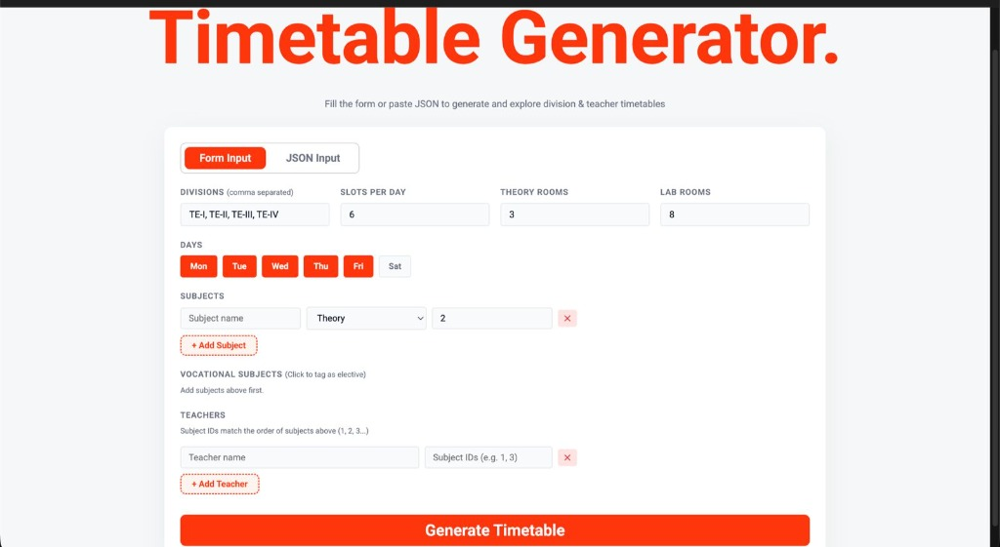
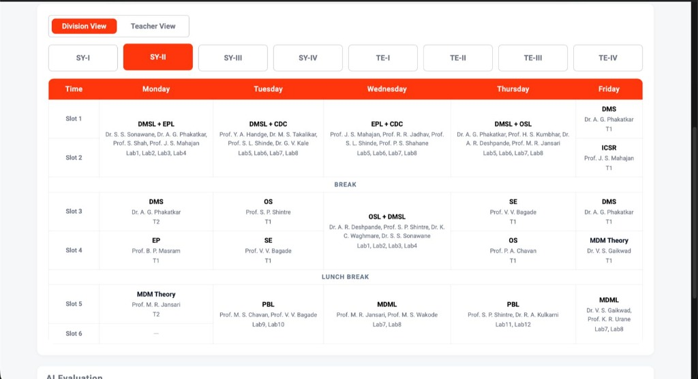
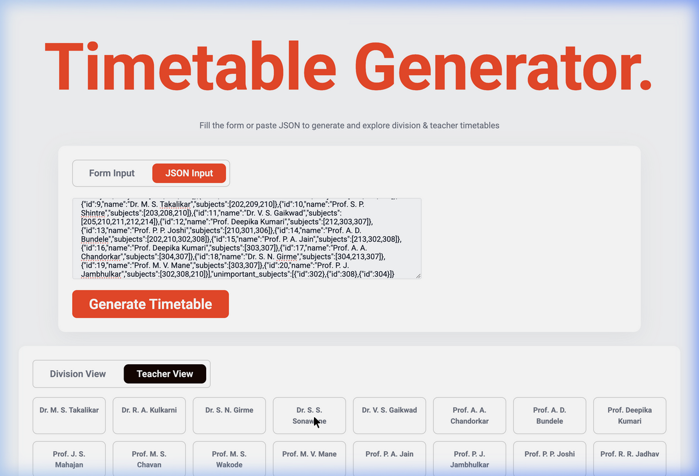
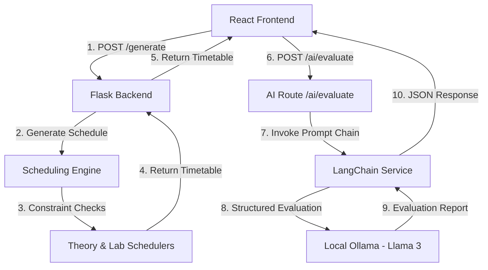

# 📅 Smart University Timetable Generator

An advanced, pedagogically-fair university timetable generator built using a hybrid constraint-satisfaction scheduling engine in Python, a modern React web interface, and an LLM-based intelligent evaluation service.

This application is designed to solve the NP-hard problem of university scheduling by respecting complex constraints—such as lab rotations, room capacity, teacher workloads, and temporal spacing—while offering an interactive dashboard to view, analyze, and optimize schedules.

---

## 📸 Visual Previews

### 1. Interactive Form & JSON Input
Define days, divisions, room counts, and dynamic lists of subjects and teachers, or paste a raw JSON configuration.


### 2. Division Timetable View
Explore division-specific timetables dynamically, showcasing allocated subjects, teachers, slots, and rooms (theory and lab).


### 3. Teacher Schedule View
Verify teacher workload distribution and specific schedules to ensure there are no overloads or overlaps.


---

## 🚀 Key Features

*   **Hybrid Constraint-Satisfaction Engine**:
    *   **Resource Management**: Tracks available theory classrooms (`T1`, `T2`, ...) and lab spaces (`Lab1`, `Lab2`, ...) to prevent overlapping room bookings.
    *   **Double-Slot Lab Scheduling**: Automatically aligns laboratory sessions into consecutive double slots (e.g., slots 0–1, 2–3, 4–5).
    *   **Joint Lab Sessions & Rotations**: Coordinates shared lab sessions involving multiple teachers, subjects, and batch rotations.
    *   **Temporal Spacing**: Prevents back-to-back lectures of the same subject on the same day and manages day-to-day lecture spacing.
*   **Teacher Workload Balancing**: Calculates teacher "pressure scores" based on specialized subject assignments, selecting candidates with the lowest current workload to prevent burnout.
*   **Vocational/Elective Subject Prioritization**: Schedules low-priority or elective subjects (tagged as "unimportant") in remaining slots, ensuring core courses take precedence.
*   **AI-Powered Timetable Evaluation**: Integrates with a local LLM via LangChain and Ollama to cross-reference generated timetables against original constraints, reporting load balance compliance and providing optimization feedback.

---

## 🛠️ Technology Stack

*   **Backend**: Python, Flask, LangChain, Ollama, `langchain-ollama`
*   **Frontend**: React (Vite), Vanilla CSS
*   **Scheduling Core**: Custom Python constraint-solver (`backend/scheduler/`)

---

## ⚙️ Setup and Installation

### Prerequisites
*   [Python 3.10+](https://www.python.org/downloads/)
*   [Node.js (v18+)](https://nodejs.org/) and npm
*   [Ollama](https://ollama.com/) (for AI evaluation service)

### 1. Set Up and Run the Backend
1. Navigate to the `backend` directory:
   ```bash
   cd backend
   ```
2. Create a virtual environment and activate it:
   ```bash
   python -m venv venv
   source venv/bin/activate  # On Windows: venv\Scripts\activate
   ```
3. Install dependencies:
   ```bash
   pip install flask flask-cors langchain langchain-ollama pydantic
   ```
4. Start the Flask server:
   ```bash
   python app.py
   ```
   The backend will run on `http://localhost:5000`.

### 2. Configure the local LLM (AI Evaluation)
1. Install [Ollama](https://ollama.com/).
2. Pull the default `llama3` model:
   ```bash
   ollama pull llama3
   ```
3. Keep the Ollama server running locally (by default on port `11434`).

### 3. Set Up and Run the Frontend
1. Navigate to the `frontend` directory:
   ```bash
   cd frontend
   ```
2. Install the node packages:
   ```bash
   npm install
   ```
3. Launch the development server:
   ```bash
   npm run dev
   ```
   Open `http://localhost:5173` in your browser.

---

## 📄 JSON Configuration Schema

The application accepts a JSON payload representing the university requirements. Below is the structure and configuration:

```json
{
  "days": ["Monday", "Tuesday", "Wednesday", "Thursday", "Friday"],
  "slots_per_day": 6,
  "divisions": [
    { "id": 201, "name": "SY-I" },
    { "id": 301, "name": "TE-I" }
  ],
  "theory_rooms": 5,
  "lab_rooms": 15,
  "subjects": [
    { "id": 201, "name": "OS", "type": "theory", "hours_per_week": 3 },
    { "id": 208, "name": "OSL", "type": "lab", "hours_per_week": 4 }
  ],
  "teachers": [
    { "id": 1, "name": "Dr. R. A. Kulkarni", "subjects": [201, 208] }
  ],
  "unimportant_subjects": [
    { "id": 208 }
  ]
}
```

### Schema Description

| Field | Type | Description |
| :--- | :--- | :--- |
| `days` | `array` of `string` | Weekdays available for classes. |
| `slots_per_day` | `integer` | Number of lecture/lab slots available per day. |
| `divisions` | `array` | Student classes/divisions. The first digit of `id` determines the academic year (e.g. `201` is Year 2, `301` is Year 3). |
| `theory_rooms` | `integer` | Count of available physical theory rooms. |
| `lab_rooms` | `integer` | Count of available physical lab rooms. |
| `subjects` | `array` | List of courses with type (`theory` or `lab`) and weekly hour requirements. |
| `teachers` | `array` | Teachers and their list of teachable subject IDs. |
| `unimportant_subjects`| `array` | List of optional/vocational subject IDs scheduled with lower priority. |

---

## 🧩 Architecture



---

## 📜 License

Distributed under the MIT License. See `LICENSE` for more information.
